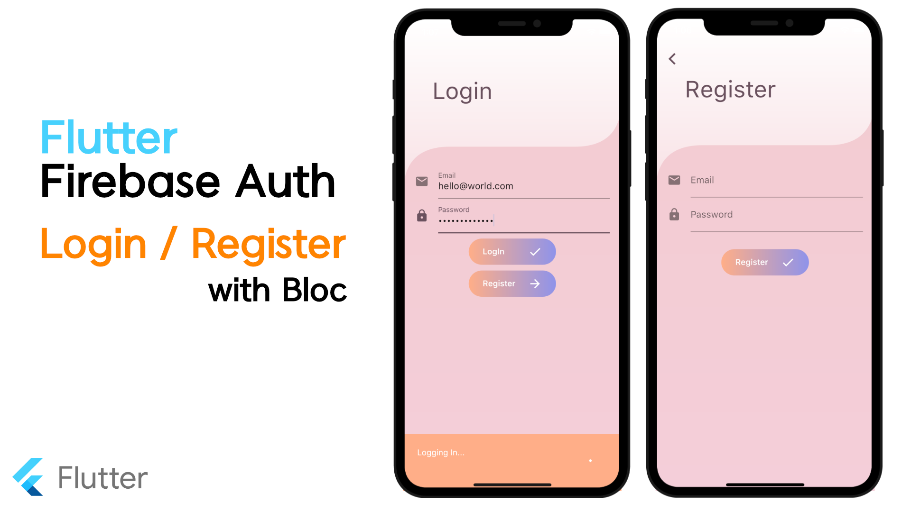

# Flutter Firebase Auth With Bloc (Login, Register)

### Youtube

### Packages
* flutter_bloc

A Flutter package that helps implement the BLoC pattern.

https://pub.dev/packages/flutter_bloc

* firebase_auth

A Flutter plugin to use the Firebase Authentication API.

https://pub.dev/packages/firebase_auth

* equatable 

Simplify Equality Comparisons

https://pub.dev/packages/equatable

